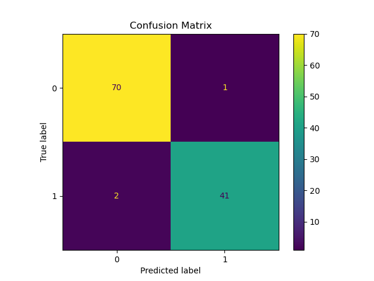
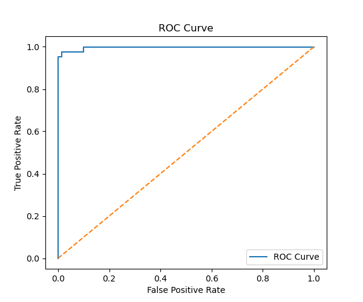
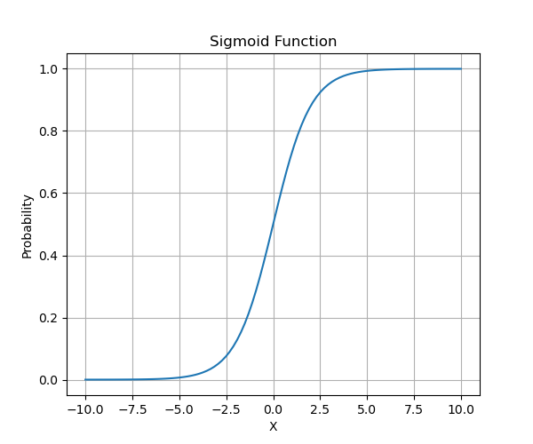

# Task 4 - Classification with Logistic Regression

## 📌 Objective
Build a binary classification model using Logistic Regression to classify breast cancer tumors as **Malignant (M)** or **Benign (B)**.

---

## 📂 Dataset

**Breast Cancer Wisconsin Dataset**

- Rows: 569
- Features: 30
- Target Column: `diagnosis`
  - M = Malignant (1)
  - B = Benign (0)

---

## 🛠️ Libraries Used

- Pandas
- NumPy
- Matplotlib
- Scikit-learn

---

## 🚀 Steps Performed

1. Imported required libraries.
2. Loaded the Breast Cancer dataset.
3. Explored the dataset.
4. Removed unnecessary columns (`id` and `Unnamed: 32`).
5. Converted diagnosis values:
   - M → 1
   - B → 0
6. Split the dataset into training and testing sets.
7. Standardized the features using StandardScaler.
8. Trained a Logistic Regression model.
9. Predicted test data.
10. Evaluated the model using:
    - Confusion Matrix
    - Classification Report
    - Precision
    - Recall
    - ROC Curve
    - ROC-AUC Score
11. Explained threshold tuning.
12. Plotted the Sigmoid Function.

---

## 📊 Model Evaluation

- Accuracy: **97%**
- Precision: **0.98**
- Recall: **0.95**
- ROC-AUC Score: **0.99**

---

## 📸 Output Images

### Confusion Matrix



---

### ROC Curve



---

### Sigmoid Function



---

## 📁 Project Structure

```
Task-4-Logistic-Regression/
│
├── breast_cancer.csv
├── logistic_regression.ipynb
├── README.md
├── requirements.txt
└── images/
      ├── confusion_matrix.png
      ├── roc_curve.png
      └── sigmoid_curve.png
```

---

## 📚 Concepts Covered

- Binary Classification
- Logistic Regression
- Feature Scaling
- Sigmoid Function
- Confusion Matrix
- Precision
- Recall
- ROC Curve
- ROC-AUC Score
- Threshold Tuning

---

## 👩‍💻 Author

**Lakshita Verma**

B.Tech CSE-AI Student  
Arya College of Engineering, Jaipur

GitHub: https://github.com/lakshitaverma25